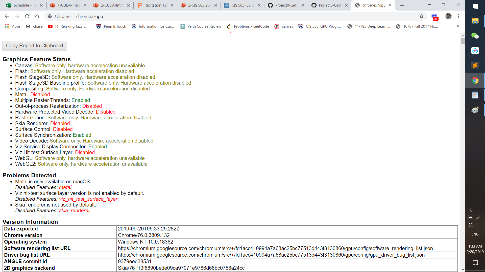
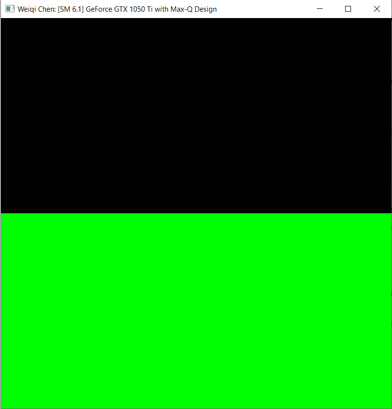
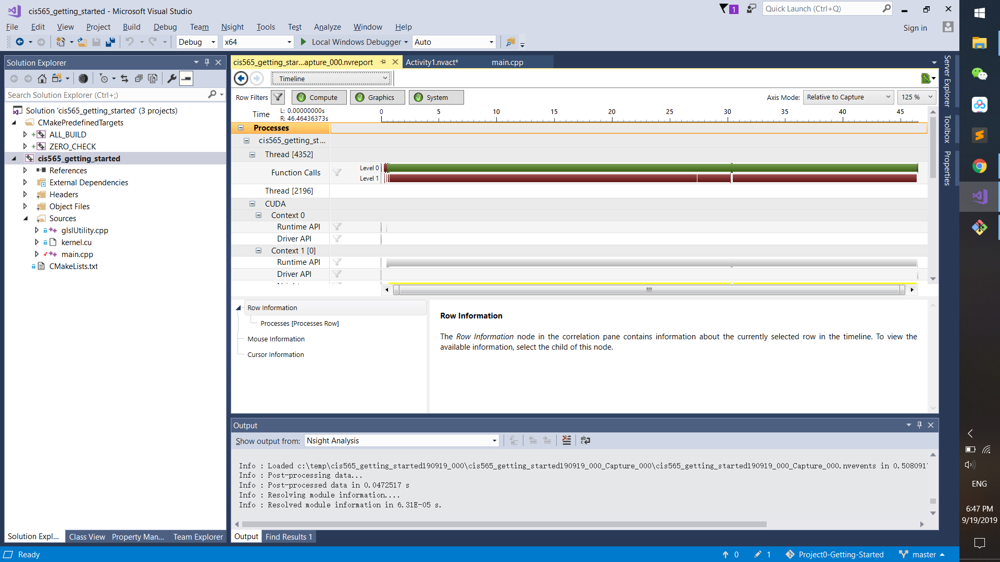
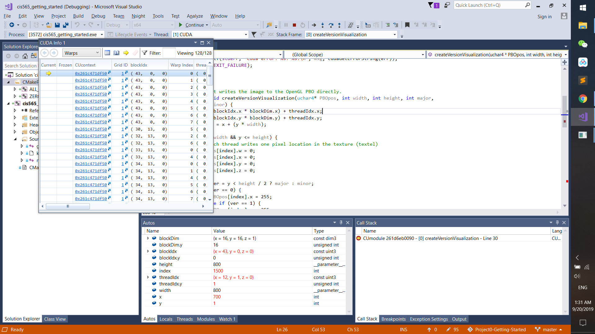

Project 0 Getting Started
====================

**University of Pennsylvania, CIS 565: GPU Programming and Architecture, Project 0**

* Weiqi Chen
  LinkedIn: https://www.linkedin.com/in/weiqi-ricky-chen-2b04b2ab/

* Tested on personal computer: Windows 10, i7-8750 @ 2.21GHz 16GB, GTX 1050 Compute Capability 6.1

### Screenshots

Working OpenGL

Modification Test

Analysis

Nsight Debugging Test

